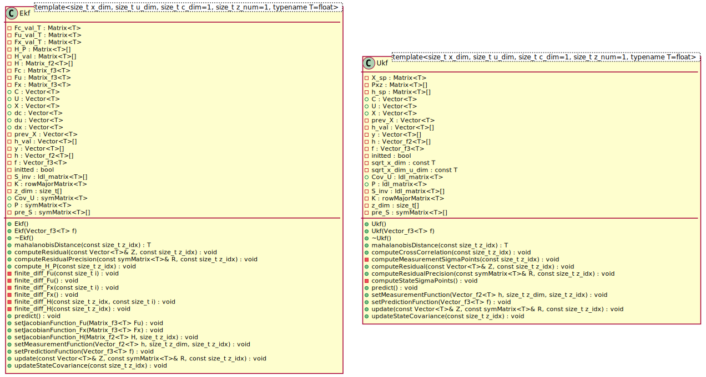
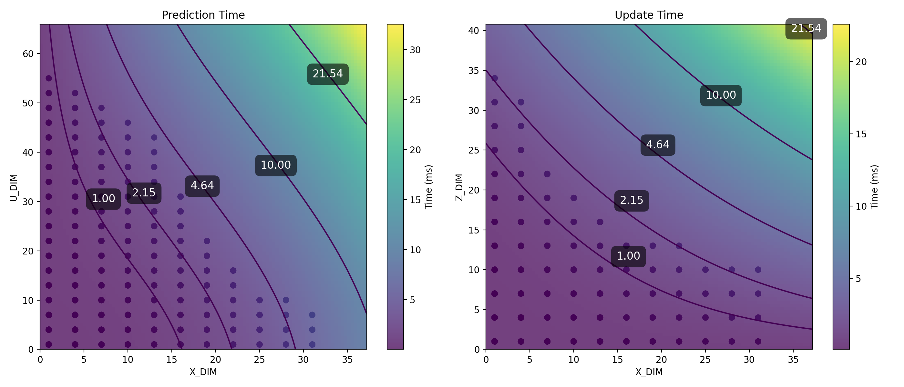

# Bayesian filters
## Overview
This library currently includes an Extended Kalman Filter (EKF) developed alongside [a linear algebra library](https://github.com/robinAZERTY/linear_algebra). Both are designed to be lightweight and efficient, making them ideal for use on embedded platforms. They are also intended to be independent of any external libraries.

## Classe(s) architecture

## Time efficiency
The duration of prediction and update steps in the Extended Kalman Filter (EKF) is analyzed below. To do this, time measurements were taken for several problem sizes, varying the number of states (X_DIM), the number of control inputs (U_DIM) and the dimension of the measurement vector (Z_DIM). Speed tests ran on ESP32 with numerical jacobian's computation enabled. This gives an idea of the maximum frequency at which this class can operate for a given problem's size.

The complexity of the EKF is obviously O(n^3).
For more details, see the [ekf_complexity_analysis](docs/efficiency/ekf_complexity_analysis.json) where coefficients are stored and can be used to predict the time needed (in micros second) for a given problem size.

## Usage
This library is ideal for anyone learning how filters work in C++ on embedded platforms. The current release includes foundational an Extended Kalman filter, using [this linear algebra library](https://github.com/robinAZERTY/linear_algebra).

## Documentation
The documentation of classes is available on [this page](https://robinazerty.github.io/bayesian_filters/doxygen/html/annotated.html).

## Current State
The library is still under development. The EKF has been tested and should be functional, as verified using UNITY. Refer to the [test section](test/) for details about the testing process, and check the [latest test coverage report](https://robinazerty.github.io/bayesian_filters/coverage_report/index.html) for an overview of the current coverage.

## Roadmap

| Task                                    | EKF | UKF | PF |
|:---------------------------------------:|:--:|:--:|:--:|
| Implement filter                        | ✅ | ⬜ | ⬜ |
| Implement 1-dimensional tests           | ✅ | ✅ | ⬜ |
| Implement n-dimensional tests           | ✅ | ⬜ | ⬜ |
| Implement performance tests             | ✅ | ⬜ | ⬜ |
| Write documentation                     | ✅ | ⬜ | ⬜ |
| Write examples                          | ✅ | ⬜ | ⬜ |

## License
This project is licensed under the GNU General Public License v3.0 - see the [LICENSE](LICENSE) file for details.

## Developer's Note
I'm a student working on this library out of curiosity and a desire to learn about matrix computations and state estimators. Through this project, I aim to deepen my understanding of these concepts, particularly in the context of embedded systems.

---
_Note: This README was partially translated from French to English with the assistance of ChatGPT._
